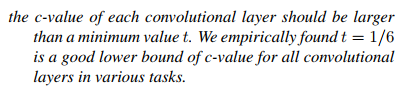

# **Behavioral Cloning** 

**Behavioral Cloning Project**

The goals / steps of this project are the following:
* Use the simulator to collect data of good driving behavior
* Build, a convolution neural network in Keras that predicts steering angles from images
* Train and validate the model with a training and validation set
* Test that the model successfully drives around track one without leaving the road
* Summarize the results with a written report

## Rubric Points
### Here I will consider the [rubric points](https://review.udacity.com/#!/rubrics/432/view) individually and describe how I addressed each point in my implementation.  

---
### Required Files

#### 1. Are all required files submitted?

My project includes the following files:
* [model.py](model.py) containing the script to create and train the model
* [drive.py](drive.py) for driving the car in autonomous mode
* [model.h5](model.h5) containing a trained convolution neural network 
* this writeup.md summarizing the results

### Code Quality

#### 1. Is the code functional?
Using the Udacity provided simulator and my drive.py file, the car can be driven autonomously around the track by executing 
```sh
python drive.py model.h5
```

#### 2. Is the code usable and readable?

The [model.py](model.py) file contains the code for training and saving the convolution neural network. The file shows the pipeline I used for training and validating the model, and it contains comments to explain how the code works.

Because the size of the data, which make it impossible to fit them entirely in memory, I chose to use generator ([model.py](model.py#L39) lines 39) so that the data is read from disk while training.

### Model Architecture and Training Strategy

#### 1. Has an appropriate model architecture been employed for the task?

My model consists of a series of convolution neural networks with 5x5 filter sizes, with depths between 32 and 256 ([model.py](model.py#L74) lines 74-83) and with several maxpooling layers put in-between.

At the end, the model includes a fully connected layer consisting 256 neurons ([model.py](model.py#L85) lines 85).

The model includes RELU layers to introduce nonlinearity, and the data is normalized in the model using a Keras lambda layer ([model.py](model.py#L72) line 72). 

#### 2. Has an attempt been made to reduce overfitting of the model?

The model was trained and validated on different data sets to ensure that the model was not overfitting ([model.py](model.py#L92) line 92). The model was tested by running it through the simulator and ensuring that the vehicle could stay on the track.

#### 3. Have the model parameters been tuned appropriately?

The model used an adam optimizer, so the learning rate was not tuned manually ([model.py](model.py#L88) line 88).

#### 4. Is the training data chosen appropriately?

I used the training data provided by Udacity. To see the whole training data easily, I first convert it to video using the provided video.py. Looking at the video, I can see that the provided data is relatively well chosen. The vehicle is driven at the center most of the time. Also there is some parts that show the car recovering from near the sides of the road. And also the car is driven clockwise and counterclockwise to provide better data for generalization.

### Model Architecture and Training Strategy

#### 1. Is the solution design documented?

To design this model, I mostly use the design guide written by one of kaggle members, provided [here](https://kaggle2.blob.core.windows.net/forum-message-attachments/69182/2287/A%20practical%20theory%20for%20designing%20very%20deep%20convolutional%20neural%20networks.pdf). The writer argues that there is a couple of constraints that when fullfilled will lead to a relatively good Very-Deep-CNN architecture. These are the following.

**First Constraint**



Which is formulated to:


**Second Constraint**


Which is formulated to:


Using these constraints, I designed the following architecture.

| Layer         		|     Description	        					                    | 
|:---------------------:|:-----------------------------------------------------------------:| 
| Cropping         	    | inputs 160x320x3,  crop 60 top, crop 20 bottom, outputs 80x320x3  |
| Lambda             	| normalize image pixels to -1 ~ 1, 80x320x3 outputs                |
| Convolution 5x5x32    | 1x1 stride, same padding, RELU activation, outputs 80x320x32 	    |
| Convolution 5x5x32    | 1x1 stride, same padding, RELU activation, outputs 80x320x32 	    |
| Convolution 5x5x32    | 1x1 stride, same padding, RELU activation, outputs 80x320x32 	    |
| Convolution 5x5x64    | 1x1 stride, same padding, RELU activation, outputs 80x320x64 	    |
| Convolution 5x5x64    | 1x1 stride, same padding, RELU activation, outputs 80x320x64 	    |
| Convolution 5x5x64    | 1x1 stride, same padding, RELU activation, outputs 80x320x64 	    |
| Convolution 5x5x64    | 1x1 stride, same padding, RELU activation, outputs 80x320x64 	    |
| Max Pooling           | 2x2 stride, outputs 40x160x64                                     |
| Convolution 5x5x128   | 1x1 stride, same padding, RELU activation, outputs 40x160x128 	|
| Convolution 5x5x128   | 1x1 stride, same padding, RELU activation, outputs 40x160x128     |
| Convolution 5x5x128   | 1x1 stride, same padding, RELU activation, outputs 40x160x128 	|
| Convolution 5x5x128   | 1x1 stride, same padding, RELU activation, outputs 40x160x128     |
| MaxPooling            | 2x2 stride, outputs 20x80x128                                     |
| Convolution 5x5x256   | 1x1 stride, same padding, RELU activation, outputs 20x80x256   	|
| MaxPooling            | 2x2 stride,  outputs 10x40x256                                    |
| Flatten               | outputs 102400                                                    |
| Fully Connected       | outputs 2048                                                      |
| Fully Connected       | outputs 1024                                                      |
| Fully Connected       | outputs 1                                                         |

In order to gauge how well the model was working, I split my image and steering angle data into a training and validation set. Then I train it using my PC with below spec:
| Parts           		| Specification 	        					                    | 
|:---------------------:|:-----------------------------------------------------------------:| 
| CPU            	    | Intel® Core™ i7-6700HQ Processor (2.60GHz 6MB)                    |
| Memory             	| 16GB DDR4 2133 MHz                                                |
| GPU                   | NVIDIA® GeForce® GTX 960M 4GB                              	    |
| Storage               | Hybrid 1TB HDD with 8GB SSD cache                          	    |
However my program did not run successfully because of GPU memory exhaustion. To make it run, I then comment out some layers and decrease the size of the remaining ones. The detailed architecture will be explained later.

After training it with 32 batch and 10 epochs, I found that my  model had low mean squared error on both the training set and the validation set, around 0.009.

To confirm the performance of my model, I run the simulator to see how well the car was driving around track one. The vehicle is able to drive autonomously around the track without leaving the road.

#### 2. Is the model architecture documented?

The final model architecture ([model.py](model.py#L70) lines 70-86) consisted of a convolution neural network with the following layers and layer sizes:

| Layer         		|     Description	        					                    | 
|:---------------------:|:-----------------------------------------------------------------:| 
| Cropping         	    | inputs 160x320x3,  crop 60 top, crop 20 bottom, outputs 80x320x3  |
| Lambda             	| normalize image pixels to -1 ~ 1, 80x320x3 outputs                |
| Convolution 5x5x32    | 1x1 stride, same padding, RELU activation, outputs 80x320x32 	    |
| Convolution 5x5x32    | 1x1 stride, same padding, RELU activation, outputs 80x320x32 	    |
| Convolution 5x5x64    | 1x1 stride, same padding, RELU activation, outputs 80x320x64 	    |
| Convolution 5x5x64    | 1x1 stride, same padding, RELU activation, outputs 80x320x64 	    |
| Max Pooling           | 2x2 stride, outputs 40x160x64                                     |
| Convolution 5x5x128   | 1x1 stride, same padding, RELU activation, outputs 40x160x128 	|
| Convolution 5x5x128   | 1x1 stride, same padding, RELU activation, outputs 40x160x128     |
| MaxPooling            | 2x2 stride, outputs 20x80x128                                     |
| Convolution 5x5x256   | 1x1 stride, same padding, RELU activation, outputs 20x80x256   	|
| MaxPooling            | 2x2 stride,  outputs 10x40x256                                    |
| Flatten               | outputs 102400                                                    |
| Fully Connected       | outputs 512                                                       |
| Fully Connected       | outputs 1                                                         |

#### 3. Is the creation of the training dataset and training process documented?

As I mentioned before, I used the training data provided by Udacity. To see the whole training data, I convert it to video using the provided video.py.

By looking at the video, I can see that the provided data does represent a relatively good driving behavior. The vehicle can be seen driven at the center most of the time. Here is an example image of center lane driving:


The data also provides some recovery driving sequences. These images show what a recovery looks like:


Also the the data provides driving sequences in the opposite direction of the track. Here is an example image of driving in the opposite direction:


To get more data set, I decided to also use the image captured by the left and right side camera. These are examples of images from the side cameras:


To augment the data set, I also flipped images and angles thinking that this would better generalize the model. For example, here is an image that has then been flipped:


After the collection process, I had 48216 number of data points. I then preprocessed this data by first cropping the top 60 pixels and bottom 20 pixels of the images. This is to eliminate the hood of the car at the bottom and the non road part of the image at the top. After that I normalize the pixel value so that it lies in the -1 ~ 1 range.

I finally randomly shuffled the data set and put 20% of the data into a validation set. 

I used this training data for training the model. The validation set helped determine if the model was over or under fitting. I used the default 32 batch size and 10 epochs of Keras. I used an adam optimizer so that manually training the learning rate wasn't necessary.
